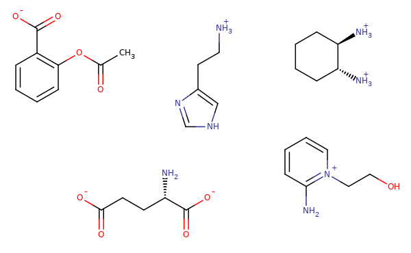

% title: Specific Aims
% subtitle: Admission to candidacy exam (ACE)
% author: Bas Rustenburg
% date: February 25th 2015
% thank_you: Fin
---
title: Aims
build_lists: true

## The binding of charged ligands

  * Host-guest model systems  
  * Corrections to free energy calculations  
  * Bayesian approach to calorimetry experiments

## Protonation state effects on binding

  * Small molecule pKa predictions  
  * Protein pKa predictions with MCCE  
  * Fluorescence and ITC experiments on kinase domains  

## Weak association and multiple binding
  * Human serum albumin as a model system  
  * Free energy calculations with semigrand canonical ensemble formalism  
  * Bayesian selection of theoretical binding models from experimental data

---

title: Aim 1
subtitle: The binding of charged ligands
class: img-top-center

---
title: Aim 1
subtitle: The binding of charged ligands
topic: Corrections to free energy calculations

A number of different corrections have been suggested.

#### Mathemathical corrections

  * <b>Rocklin et al.</b>
  J. Chem. Phys. 139, 184103 (2013);
  http://dx.doi.org/10.1063/1.4826261

  * <b>Reif and Oostenbrink</b>
  Journal of Computational Chemistry 2014, 35, 227–243
  http://dx.doi.org/10.1002/jcc.23490

#### Creating/destroying salt pairs
  * Are corrections necessary?

---

title: Aim 1
subtitle: The binding of charged ligands
topic: Host-Guest systems as model systems

provide a way to study binding interactions without the issues like:

<table>
    <td>
        <ul>
            <li> Expressing and purifying a protein</li>
            <li> Obtaining high concentration necessary for ITC experiments </li>
            <li> Timescale needed for molecular dynamics</li>
        </ul>
    </td>
    <td>
        

    </td>
</table>

Cucurbit-[7]-uril, a host molecule that binds cationic guests.

---
title: Aim 2
subtitle: Protonation state effects on binding
class: img-top-center

---

title: Aim 2
subtitle: Protonation state effects on binding
topic: Why is it important to consider protonation states?

  * Proteins and small molecules can sample mixtures of different protonation states

  * These states all contribute to the binding affinity, possibly contributing several kcal / mol

#### Why is it a problem?

  * We do not know in which proteins this occurs, and in which it does not!

---

title: Aim 2
subtitle: How can we take the pKa into account?
topic: Computationally survey

#### Small molecules

* Using tools such as schrodingers Epik, Jaguar

#### Proteins
* Tools such as PROPKA
* MCCE2 (Gunner et al.)

#### And then perform free energy calculations

* Constant-pH simulations using the obtained pKa data

---
title: Aim 2
subtitle: How can we take the pKa into account?
topic: Experimentally

#### Measure binding affinity using

* Fluorescence assays for kinase domains

* Isothermal titration calorimetry experiments

---
title: Aim 3
subtitle: Weak association and multiple binding

[replace this by an image]

---

title: Aim 3
subtitle: Weak association and multiple binding
topic: Bayesian modelling of ITC
class: img-top-center

We can describe binding of multiple ligands

##### The heats of binding as a function of concentration

##### The posterior

---

class: thank-you-slide
